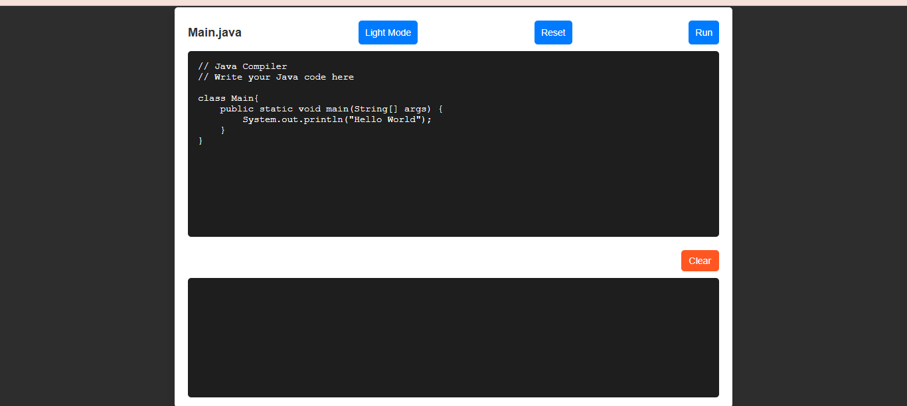

# Online Java Compiler 
	This is a simple web-based Java compiler that allows users to write, compile, and execute Java code online. compile and view the output or errors in real-time.

## Output

## Features

	- **Code Editor**: Provides a text editor for users to input their Java code.
	
	- **Compile and Execute**: Users can compile and execute their Java code directly from the web interface. Compilation errors and runtime errors are displayed in the output window.
	
	- **Reset Functionality**: Provides a reset button to clear the code editor and start fresh.
	
	- **Mode Functionality**: The Light and Dark Mode feature allows users to switch between light and dark themes for better readability and personalization.
	
	
	
## Usage

1. Ensure that Java Development Kit (JDK) is installed on your system.
2. Deploy the provided servlet on Apache Tomcat, a Java Servlet Container.
3. Start Apache Tomcat server.
4. Open the web application in your browser.
5. Write or paste your Java code in the editor.
6. The class name should be `Main.java`
7. Click the "Run" button to compile and execute the code.
8. View the output or errors in the output window.
9. The Light and Dark Mode feature allows users to switch between light and dark themes for better readability and personalization.
10. Use the reset button to clear the editor if needed.

## Installation

1. Clone or download the repository to your local machine.
2. Copy the provided servlet to the "webapps" directory of Apache Tomcat.
3. Start Apache Tomcat server.
4. Open the provided HTML file in a web browser to use the Java compiler.
